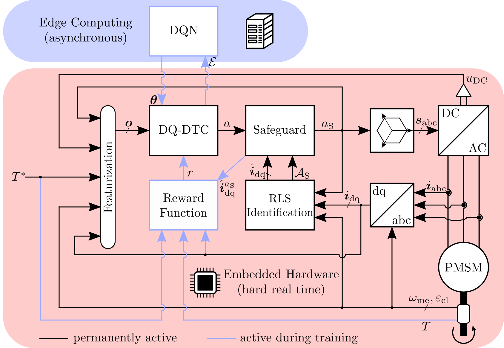
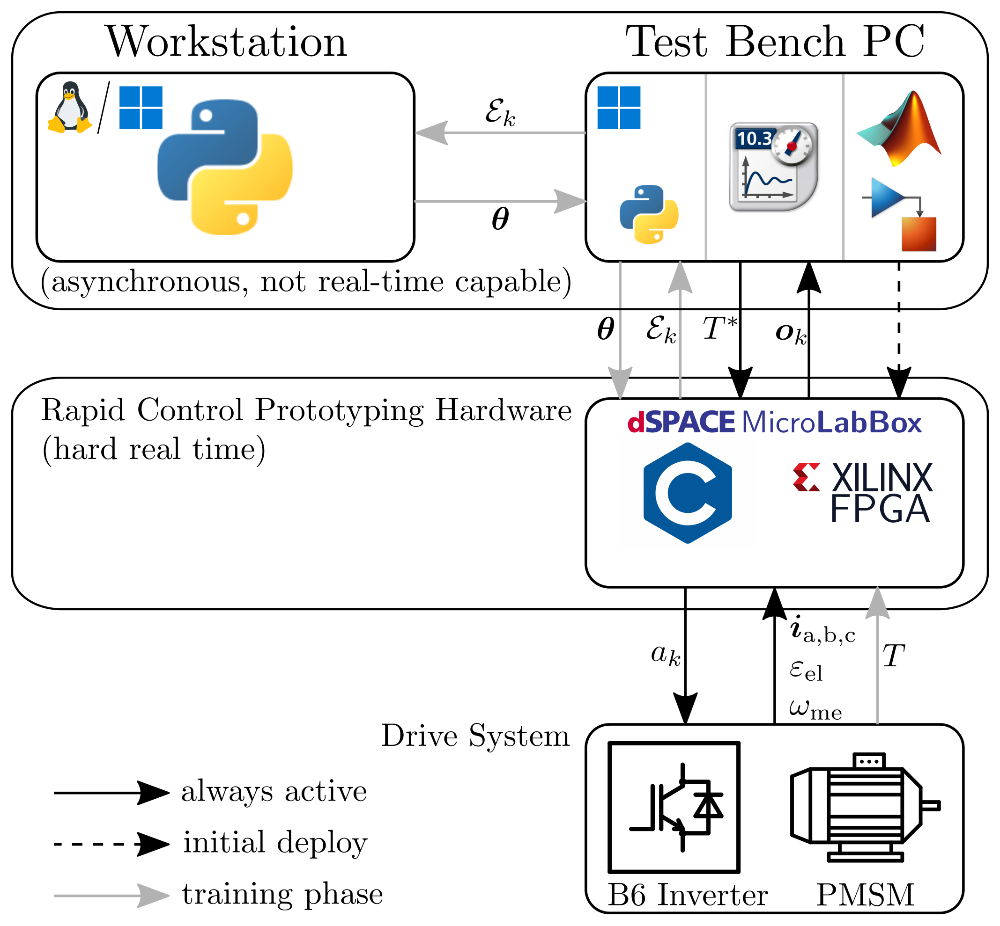

# Finite-Set Direct Torque Control via Edge Computing-Assisted Safe Reinforcement Learning for a Permanent Magnet Synchronous Motor
This GitHub page features the EdgeRL toolchain used in the paper "Finite-Set Direct Torque Control via Edge Computing-Assisted Safe Reinforcement Learning for a Permanent Magnet Synchronous Motor"

[Read the paper (IEEE Xplore)](https://ieeexplore.ieee.org/document/10214121) or watch the video:

The toolchain featured in this repository is used for reinforcement learning (RL) applications within real-world experiments. It was originally crafted for finite-set motor control.

State transition samples that have been measured on an available plant system are sent from the test bench computer to an edge computing workstation via TCP/IP.
On the workstation, the applied training algorithm (Deep Q Network, DQN) processes the acquired samples in order to determine a new policy for controlling the plant system.
The weighting parameters describing the new policy are then sent back to the test bench and can be applied within the operating rapid-control prototyping interface.
This enables asynchronous RL for real-world applications without the need to shut down the plant system.

The necessary files for each component of the toolchain are provided in the corresponding folders. For real-time capable inference of the DQN in the test bench application, this contribution utilizes FPGA hardware whose programming was synthezised using MATLAB/Simulink's script-based model generation

Rapid-control prototyping hardware: dSPACE MicroLabBox

Software:
  - Test bench PC (Windows): 
    - MATLAB / Simulink
    - dSPACE ControlDesk
    - Python
  - Edge Workstation (Windows or Linux):
    - Python
    - that's it
    

